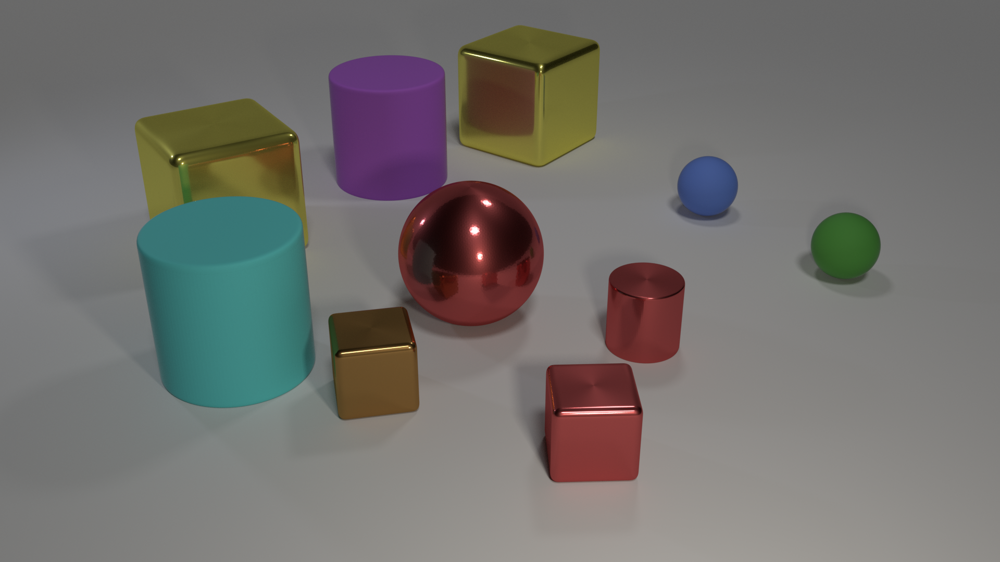
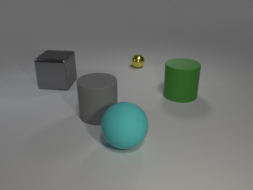
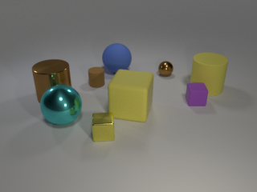
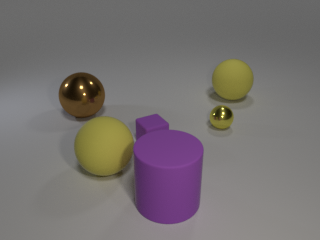
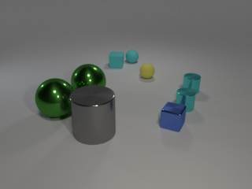
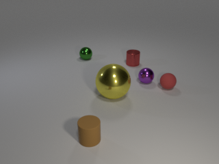
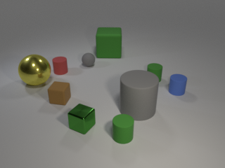

# Space Verification


步骤从1-3顺序执行，4或5根据需求选其一。

以下步骤基于开源项目CLEVR修改得到的，建议维护人员仔细阅读步骤4,5相关代码，另写脚本，根据生产需求整合步骤。

（*注意：步骤1生成的图片保存于项目目录的output文件夹中，之后的步骤依赖于此文件夹，并将结果保存于该文件夹中。）

## 1.生成图片
cd /mnt/old/cy_worksapce/clevr-dataset-gen-master/image_generation

blender --background --python render_images.py -- --width 344 --height 344 --num_images 10 --use_gpu 1

## 2.生成问题：
### 中文：
cd /mnt/old/cy_worksapce/clevr-dataset-gen-master/question_generation

python3 generate_questions.py

### 英文：
cd /mnt/old/cy_worksapce/clevr-dataset-gen-master/question_generation_en

python3 generate_questions.py

## 3.计算答案区域:
cd /mnt/old/cy_worksapce/clevr-dataset-gen-master

python3 test.py

## 4.本地得到图片数据
python3 push2local.py

备注：图片需要加上底部“黑条”，尺寸（高40，宽344）

## 5.（或）上传至线上
python3 push2oss.py

## 其他
### 问题模板

中文：/mnt/old/cy_worksapce/clevr-dataset-gen-master/question_generation/CLEVR_1.0_templates

英文：/mnt/old/cy_worksapce/clevr-dataset-gen-master/question_generation_en/CLEVR_1.0_templates


-------------------------------------------------------------------------------
# CLEVR Dataset Generation

This is the code used to generate the [CLEVR dataset](http://cs.stanford.edu/people/jcjohns/clevr/) as described in the paper:

**[CLEVR: A Diagnostic Dataset for Compositional Language and Elementary Visual Reasoning](http://cs.stanford.edu/people/jcjohns/clevr/)**
 <br>
 <a href='http://cs.stanford.edu/people/jcjohns/'>Justin Johnson</a>,
 <a href='http://home.bharathh.info/'>Bharath Hariharan</a>,
 <a href='https://lvdmaaten.github.io/'>Laurens van der Maaten</a>,
 <a href='http://vision.stanford.edu/feifeili/'>Fei-Fei Li</a>,
 <a href='http://larryzitnick.org/'>Larry Zitnick</a>,
 <a href='http://www.rossgirshick.info/'>Ross Girshick</a>
 <br>
 Presented at [CVPR 2017](http://cvpr2017.thecvf.com/)

Code and pretrained models for the baselines used in the paper [can be found here](https://github.com/facebookresearch/clevr-iep).

You can use this code to render synthetic images and compositional questions for those images, like this:

<div align="center">
  
</div>

**Q:** How many small spheres are there? <br>
**A:** 2

**Q:**  What number of cubes are small things or red metal objects? <br>
**A:**  2

**Q:** Does the metal sphere have the same color as the metal cylinder? <br>
**A:** Yes

**Q:** Are there more small cylinders than metal things? <br>
**A:** No

**Q:**  There is a cylinder that is on the right side of the large yellow object behind the blue ball; is there a shiny cube in front of it? <br>
**A:**  Yes

If you find this code useful in your research then please cite

```
@inproceedings{johnson2017clevr,
  title={CLEVR: A Diagnostic Dataset for Compositional Language and Elementary Visual Reasoning},
  author={Johnson, Justin and Hariharan, Bharath and van der Maaten, Laurens
          and Fei-Fei, Li and Zitnick, C Lawrence and Girshick, Ross},
  booktitle={CVPR},
  year={2017}
}
```

All code was developed and tested on OSX and Ubuntu 16.04.

## Step 1: Generating Images
First we render synthetic images using [Blender](https://www.blender.org/), outputting both rendered images as well as a JSON file containing ground-truth scene information for each image.

Blender ships with its own installation of Python which is used to execute scripts that interact with Blender; you'll need to add the `image_generation` directory to Python path of Blender's bundled Python. The easiest way to do this is by adding a `.pth` file to the `site-packages` directory of Blender's Python, like this:

```bash
echo $PWD/image_generation >> $BLENDER/$VERSION/python/lib/python3.5/site-packages/clevr.pth
```

where `$BLENDER` is the directory where Blender is installed and `$VERSION` is your Blender version; for example on OSX you might run:

```bash
echo $PWD/image_generation >> /Applications/blender/blender.app/Contents/Resources/2.78/python/lib/python3.5/site-packages/clevr.pth
```

You can then render some images like this:

```bash
cd image_generation
blender --background --python render_images.py -- --num_images 10
```

On OSX the `blender` binary is located inside the blender.app directory; for convenience you may want to
add the following alias to your `~/.bash_profile` file:

```bash
alias blender='/Applications/blender/blender.app/Contents/MacOS/blender'
```

If you have an NVIDIA GPU with CUDA installed then you can use the GPU to accelerate rendering like this:

```bash
blender --background --python render_images.py -- --num_images 10 --use_gpu 1
```

After this command terminates you should have ten freshly rendered images stored in `output/images` like these:

<div align="center">
  
  
  
  <br>
  
  
  
</div>

The file `output/CLEVR_scenes.json` will contain ground-truth scene information for all newly rendered images.

You can find [more details about image rendering here](image_generation/README.md).

## Step 2: Generating Questions
Next we generate questions, functional programs, and answers for the rendered images generated in the previous step.
This step takes as input the single JSON file containing all ground-truth scene information, and outputs a JSON file 
containing questions, answers, and functional programs for the questions in a single JSON file.

You can generate questions like this:

```bash
cd question_generation
python generate_questions.py
```

The file `output/CLEVR_questions.json` will then contain questions for the generated images.

You can [find more details about question generation here](question_generation/README.md).
